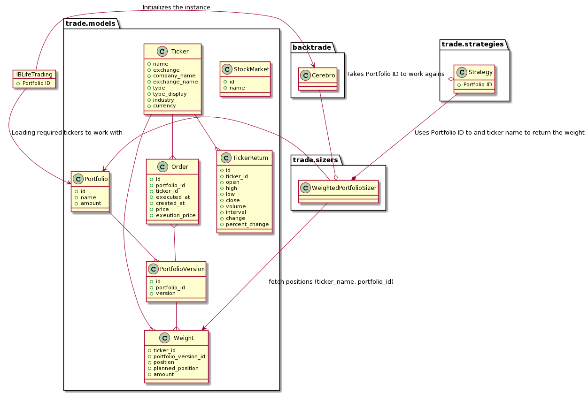

######
Trade
######

[NAME] - is trading and asset management system.

Why?
====
I want to have a passive income based on investing.

Main features
=============

Not all of them are supported at the moment

- portfolio building
- managing multiple portfolios
- portfolio rebalancing
- CPPI
- automated trading

  - building and using multiple stategies that works together
  - integration with IB
  - Web and CLI interfaces

Collaborators
=============
- `Artem M <https://github.com/ignar>`_
- `Ihor M <https://github.com/IhorMok>`_

Installation
############

Docker version

Quick start
^^^^^

.. code:: bash

   docker-compose up
   docker-compose run -e ENV_FILE=.env.test trade python ./bin/db.py create_database
   docker-compose run -e ENV_FILE=.env.dev trade python ./bin/db.py create_database
   docker-compose run -e ENV_FILE=.env.test trade python ./bin/db.py create_tables
   docker-compose run -e ENV_FILE=.env.dev trade python ./bin/db.py create_tables
   docker-compose run -e ENV_FILE=.env.test trade pytest tests/

Run in host network
^^^^^^^^^^^^^^^^^^^

.. code:: bash

   docker build --tag trade:v[x] .
   docker run --rm -it --network host -v "$PWD:/usr/src/app" trade:v[x] run/account.py status

Create database & tables
^^^^^^^^^^^^^^^^^^^^^^^^

.. code:: bash

    docker-compose --env-file .env.${ENV} up
    docker-compose run -e ENV_FILE=.env.${ENV} trade python ./bin/db.py create_database
    docker-compose run -e ENV_FILE=.env.${ENV} trade python ./bin/db.py create_tables

Run tests
^^^^^^^^^

.. code:: bash

    docker-compose run -e ENV_FILE=.env.test trade pytest tests/

Alternatively possible to run using Makefile
^^^^^^^^^^^^^^

.. code:: bash

    make tests

Connect to database
^^^^^^^^^^^^^^^^^^^

.. code:: bash

    docker-compose exec db psql -U <USER> <DATABASE>

Run Jupyter
^^^^^^^^^^^

.. code:: bash

    docker-compose run -e ENV_FILE=.env.dev -p 8888:8888 trade jupyter-lab --allow-root --ip=0.0.0.0

Plain code version
^^^^^^^^^^^^^^^^^^

.. code:: bash

    brew install postgresql
    echo '3.LATEST' > .python-version
    pyenv install
    poetry install

Troubleshoots
^^^^^^^^^^^^^

.. code:: bash
    pip install --upgrade pip
    pip install numpy
    pip install qdldl
    pip install osqp
    pip install cvxpy
    pip install cvxopt
    poetry install

Basic development process
^^^^^^^^^^^^^^^^^^^^^^^^^

.. code:: bash

   git checkout master
   git pull origin master
   git checkout -b feature-<NAME>
   git branch
   # make changes
   docker-compose run -e ENV_FILE=.env.dev trade black trade
   git add -p
   git status
   git commit -m "Update ..."
   git log
   git push origin feature-<NAME>

What to in case of local changes that prevents to checkout branch
^^^^^^^^^^^^^^^^^^^^^^

.. code:: bash

    git stash
    git checkout branch
    git stash pop

Download all tickers
--------------------

.. code:: bash

    YahooTickerDownloader.py

Application diagram
-------------------

Thought & ideas
---------------

Jan 7
^^^^^
- [ ] Was reading https://www.backtrader.com/docu/live/ib/ib/ and how to connect IB.
  The objective is to connect IB with backtrader and try it with SMA strategy
- [ ] Keep in mind how to manage existing portfolio with CPPI strategy

Mar 28
^^^^^^
- [ ] Rebuild portfolio for assets
- [ ] Rebuild portfolio for ETFs
- [ ] Buy using EB clients according to calculations
  - Save calculations
  - Buy on the breakthrought upright moment
- [ ] Monitor changes of each position and sell on peak
- [ ] Monitor changes of each position and sell on reaching a drawdown limit (CPPI)
- [x] Dockerize app
  - Jupyter image
  - Application image

Apr 11
^^^^^^
- [x] Docker composer with PG
- [x] Different PG environments for test and development

Apr 13
^^^^^^
- [x] Check run/tickers
- [x] Check run/history
- [ ] Use HistoryDataLoader service
- [x] Calculate weights and save in DB
- [x] Use calculated weights buy

Apr 25
^^^^^^
- [x] Strategy that uses multiple data sources (simple version) loaded from Portfolio
- [x] Strategy that uses multiple data sources (advance version)
- [ ] Check for margins
- [ ] Use order_target_percent instead of buy
- [x] Version weights by adding version to the model
- [x] Track latest portfolio version (Portfolio Version model) and associate weights with each version
- [x] Why it doesn't sell?

Apr 30
^^^^^^
- [x] Try out strategy on 5 minutes tickers
- [x] Save executed and attempted orders in DB
- [x] Repository to handle data creation like created_at and updated_at

May 3
^^^^^
- [x] mypy
- [ ] use tickers returns repository in history runner

May 6
^^^^^
- [x] Run MdMACDStrategy together with Portfolio repository like in tutorial runner to buy and sell
- [x] Persist orders

May 8
^^^^^
- [ ] CLI to execute commands like create new portfolio and add symbols to it with 0 weight
- [x] Find statistic with sell and test that it is saved
- [x] Update order on complition
- [x] Eliminate mypy, flake8 complains

May 19
^^^^^^
- [x] Add value field to Portfolio model
- [x] Test ValueProtectingStrategy
- [x] Update ValueProtectingStrategy to detect buy

May 21
^^^^^^
- [x] Use Order model to track ongoing strategy orders
- [x] Ability to disable strategy for portfolio
- [x] ValueProtectingStrategy must disable buy for other strategies
- [ ] Seeds